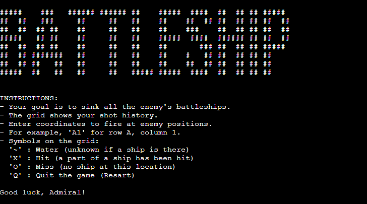

# Battleship Game

## Introduction
Battleship is a classic naval strategy game. This Python-based implementation brings the traditional game to life in a console-based format. The Player engages in a tactical duel to locate and destroy the enemy's fleet using strategic guessing and deduction.

## Key Features
- **Randomized Ship Placement**: Each game has a unique setup with ships placed randomly on the grid.
- **Player Input Validation**: Ensures that players' guesses are within the game's grid and correctly formatted.
- **ASCII Art and Styling**: Welcomes players with engaging ASCII art and clear, styled game text.
- **Interactive Gameplay Instructions**: Offers detailed explanations of game rules and symbols used on the grid.
- **Flexible Game Exit**: Allows players to quit the game at any time by pressing 'Q'.
- **Win and Lose Conditions**: Informs players when they have successfully sunk all ships or when they run out of guesses.

# Battleship Game User Stories

### 1. Start a New Game
- **As a player**, I want to start a new game easily so that I can quickly engage in gameplay.

### 2. Understand Game Rules
- **As a new player**, I want to read clear instructions when I start the game so that I can understand how to play.

### 3. Enter Guesses
- **As a player**, I want to enter my guesses for ship locations so that I can try to sink the enemy ships.

### 4. Receive Feedback on Guesses
- **As a player**, I want to receive immediate feedback on my guesses so that I know whether I hit or missed a ship.

### 5. View Game Progress
- **As a player**, I want to view the current state of the game grid after each guess so that I can track my progress and plan my next move.

### 6. Quit the Game
- **As a player**, I want the option to quit the game at any time so that I can stop playing whenever I need to.

### 7. Play Multiple Rounds
- **As a player**, I want to be able to start a new game immediately after one ends so that I can play multiple rounds without restarting the application.

### 8. Learn Game Outcome
- **As a player**, I want to know when the game is over and whether I won or lost so that I can understand the outcome of my efforts.

## Technologies Used

- [Python](https://www.python.org/)
- [pip](https://pip.pypa.io/en/stable/) .
- [Git](https://git-scm.com/) 
- [GitHub](https://github.com/)
- [Codeanywhere](https://codeanywhere.com/) as a cloud based IDE.

# Manual Testing Documentation for Battleship Game

## Introduction
This document outlines the manual testing procedures and results for the Battleship game. Testing aims to ensure the game's functionality, usability, and error handling align with the game's requirements.

## Test Scenarios

### 1. Game Initialization
- **Objective**: Verify that the game initializes correctly with the welcome screen and instructions.
- **Procedure**: Start the game and observe the initial output.
- **Expected Result**: The game displays the ASCII art, welcome message, and instructions.

### 2. Input Validation
- **Objective**: Ensure that the game correctly validates user input.
- **Procedure**: Enter various inputs, including valid coordinates (e.g., A5), invalid coordinates (e.g., Z9), and non-coordinate inputs (e.g., random text).
- **Expected Result**: The game should accept valid coordinates, reject invalid ones, and prompt for re-entry.

### 3. Hit and Miss Feedback
- **Objective**: Confirm the game provides accurate feedback for hits and misses.
- **Procedure**: Enter coordinates known to hit or miss based on the ship placement.
- **Expected Result**: The game updates the grid with 'X' for hits and 'O' for misses.

### 4. Quit Functionality
- **Objective**: Test the functionality of quitting the game.
- **Procedure**: Press 'Q' during the game to initiate a quit.
- **Expected Result**: The game should terminate immediately.

### 5. Win Condition
- **Objective**: Check if the game correctly identifies a win condition.
- **Procedure**: Play the game and successfully hit all ship locations.
- **Expected Result**: The game should display a victory message upon sinking all ships.

### 6. Lose Condition
- **Objective**: Ensure the game recognizes a lose condition.
- **Procedure**: Play the game and exhaust all guesses without sinking all ships.
- **Expected Result**: The game should end and display a game over message.

### 7. Replayability
- **Objective**: Verify that the game can be played multiple times consecutively.
- **Procedure**: Restart the game after completion and play again.
- **Expected Result**: The game should reinitialize and be playable again.

## Conclusion
The Battleship game underwent thorough manual testing. The above scenarios confirm that the game meets its functional requirements and provides a user-friendly experience. Future tests may include scenarios for extended gameplay, edge cases, and usability tests for different user demographics.

## Deployment

## 1. Prepare the App

- I ensured that the app was fully up to date on GitHub.

## 2. Create a Heroku App

- Log into Heroku and click Create App. 
- Enter the App name and select your region. Click Create App
- 

## 4. Set Up Environment Variables and settings

- Add Config Vars to the App. (Port:8000)
- Add pyhton Buildpack and then nodejs Buildpack. Ensure python Buildpack is above the nodejs Buildpack

## 5. Deploy the App

- Naviagte back to the Deploy menu. 
- In Deployment Method, select GitHub and authorize.
- Search for the repository and confirm connection.
- Select Automatic Deployment

## 6. Access the App

- Once deployed, you can access your app at `https://battleship-pp3-bc-5c9e33504ea7.herokuapp.com/`.
